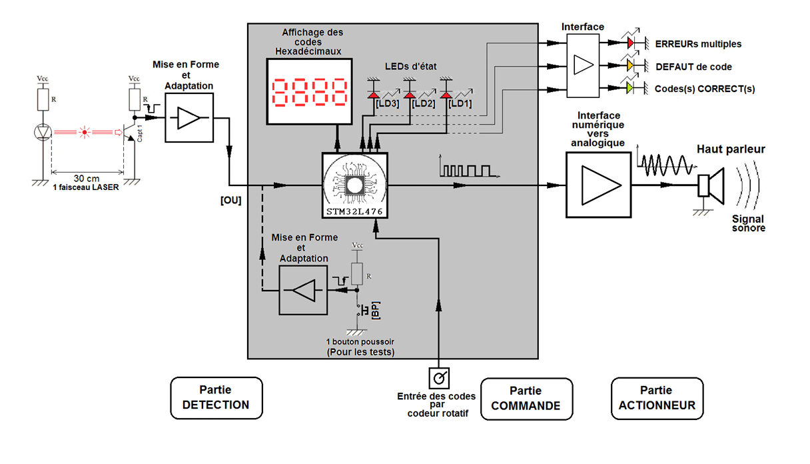
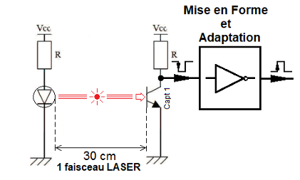
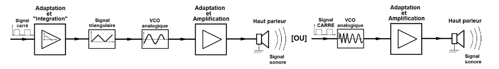

# Obstacle Detection Alarm Secured by Protection Codes

## Description

This project outlines the design and implementation of an obstacle detection system that triggers a frequency-modulated audible alarm upon detecting a disrupted red LASER beam. The alarm's deactivation is secured through a precise sequence of three hexadecimal codes, complemented by a rescue code for single errors and a super-code for multiple erroneous entries. This system is ideally suited for various security, surveillance, or access control applications where the detection of unauthorized presence or intrusion is paramount.

## Table of Contents

- [Features](#features)
- [Required Hardware](#required-hardware)
- [Schematics](#schematics)
- [Installation](#installation)
- [Usage](#usage)
- [Contributing](#contributing)

## Features

- **Optical Detection**: The system employs a red LASER emitter and a pair of BPX81 phototransistors for precise obstacle detection. During initial testing phases, a push-button can substitute the optical detection for functional verification. The detection logic utilizes a 74LS32 OR gate, which triggers the alarm as soon as either sensor detects a beam interruption. Visual feedback for sensor activation is provided by a green LED. A LM311 comparator then converts the analog output of the OR gate into a binary signal compatible with the microcontroller.

- **Audible Alarm****: The alarm generates a distinctive two-tone binary modulated sound, alternating between 2500 Hz and 5000 Hz every 0.5 seconds. The core of the sound generation is the XR2206 integrated circuit, configured as a voltage-controlled oscillator (VCO), capable of generating a clean sinusoidal signal. The signal processing chain involves integrating the microcontroller's square wave output into a triangular signal (0-3V) suitable for the XR2206's VCO input, followed by amplification via a push-pull stage to drive the KSSG1708 loudspeaker.

- **Security** Sequence: Alarm deactivation is protected by a precise three-code hexadecimal sequence (Code 1, Code 2, Code 3). In case of an incorrect entry, a "DEFAUT" rescue code (Code 4) can be used for a restricted unlock. For multiple errors, an "ERREUR" super-code (Code 5) is required to fully reset the system procedure. This sequential logic is managed by a state machine implemented in the microcontroller's firmware.

- **Visual Indicators**: The system provides clear visual feedback through three LEDs: a green LED indicates a correct procedure in progress (States 1, 2, and 3). An orange LED signifies the "DEFAUT" state, while a red LED illuminates for the "ERREUR" state. These LEDs are directly driven by the microcontroller.

- **Microcontroller**: The STM32L476RG microcontroller (Nucleo-L476RG development board) serves as the central processing unit, handling the sequential and combinational logic for code verification, error state management (DEFAUT, ERREUR), and memory for predefined codes. It interfaces with a rotary encoder for user input  and an OLED-SSD1306 display for detailed system status and code entry prompts. The microcontroller's internal peripherals, such as timers (TIM2 for encoder, TIM4 for PWM siren ) and external interrupts (EXTI for encoder button ), ensure real-time and reactive system operation.

## Required Hardware

- **LASER emitter**: ADL-65075TL (not explicitly mentioned as a specific component but implied by "red LASER beam" ).
  
- **Phototransistor**: BPX81.
  
- **Operational amplifiers**: TL082  (used in the audio signal chain ).
  
- **Comparator**: LM311.
  
- **Logic Gate**: 74LS32 (OR gate).
  
- **Timer**: While a NE555 is listed in the example, the STM32L476RG's internal timers (TIM2, TIM4) are primarily used for encoder interface  and PWM siren generation  in the project.
  
- **Function generator**: XR2206.
  
- **Mini speaker**: KSSG1708.
  
- **DC-DC Converter**:
IA1215S (for ±15V symmetric power to the audio circuit).
Wurth 173010542 (12V to 5V conversion for the control part).

- **LDO Regulator**: AZ1117CH2-3.3TRG1 (SOT-223 package, for 5V to 3.3V regulation).

- **Development board**: STM32L476RG (Nucleo-L476RG).

- **LEDs**:
Red LEDs (0603 SMD): Quantity: 4 (for power control  and error indication ).
Yellow LED (0603 SMD): Quantity: 1 (for DEFAUT state indication).
Green LED (0603 SMD): Quantity: 1 (for correct procedure indication).

- **Resistors**: Various values (e.g., 220Ω, 400Ω, 800Ω, 1kΩ, 1.6kΩ, 5.1kΩ, 820Ω, 10kΩ, 15kΩ, 3.3kΩ ).
  
- **User inputs**: Rotary encoder (Incrémental MEC (482016514001)) with integrated push-button.

- **Display**: OLED-SSD1306 (I2C interfaced, SBC-OLED01 model).

- **Capacitors**: A range of ceramic (10nF, 100nF ) and electrolytic (1µF, 10µF, 22µF, 47µF, 100µF ) capacitors for filtering, decoupling, and signal coupling.

- **Connectors**: JST connectors (Conn_01x02, Conn_01x03, Conn_01x04 ) for inter-module connections and power input.

- **Protection Diodes**: ESD diodes (WE 82402374) for protecting I2C and encoder lines from electrostatic discharge.

- **Potentiometers**: 20KΩ, 50KΩ, 500Ω  for fine-tuning.

## Schematics

1. **System General Diagram**  
   
   A comprehensive block diagram illustrating the interconnections between the main functional modules: Supply (providing +12V, +5V, +3.3V), NUCLEO-L476RG microcontroller, Rotary Encoder, and Input/Output signals (VALID_ALARM, SIG_ALARM, INPUT, INPUT_Supply). It also shows the I2C connection to the OLED-SSD1306 display  and the mounting holes for the PCB.
   
3. **Sensor Model**  
   
   This schematic details the obstacle detection unit. It includes two BPX81 phototransistors (Q1, Q2)  that detect the interruption of the LASER beam. Their outputs feed into a 74LS32 OR gate (U1), which activates when either beam is broken. A verification LED (D3, GREEN_LED)  provides visual confirmation of sensor activation. The signal is then passed to an LM311 comparator (U2), which compares the OR gate's output to a 2.5V reference voltage, producing a binary signal for the microcontroller. This section also includes power supply filtering and visual indicators using NPN (2N1711) and PNP (2N2905) transistors.
   
5. **Audio Signal Chain**  
   
   This diagram illustrates the steps involved in generating and amplifying the alarm sound. The process begins with a square wave signal (0 to 3.3V) from the microcontroller (STM32). This signal is then integrated by an operational amplifier (U1A) to transform it into a triangular wave centered at 0V (±1.65V). A second operational amplifier (U1B), configured as a non-inverting amplifier, shifts and scales this signal to a 0-3V range, suitable for the XR2206's VCO input. The XR2206 (U2) then generates the frequency-modulated sinusoidal signal (2500 Hz / 5000 Hz). Finally, this signal is amplified by a symmetric push-pull stage using 2N1711 (Q1) and 2N2905 (Q2) transistors  to drive the KSSG1708 loudspeaker (LS1). The audio circuit is powered by a ±15V symmetric supply generated by an IA1215S DC-DC converter (PS1) from a 12V input.
   
7. **Unlock Sequence**  
   
   This state graph (Figure 1.1) visually represents the precise sequential logic for alarm deactivation. Starting from the "ALARME INACTIVE" (Etat 0) state, an active sensor transitions the system to "ALARME ACTIVE" (Etat 1). The user must then enter three correct codes sequentially (Code 1, Code 2, Code 3), moving through Etat 1, Etat 2, and Etat 3. If any code is incorrect, the system branches to a "DEFAUT" state (Etat 4), requiring Code 4. If Code 4 is incorrect, or multiple errors occur, it transitions to an "ERREUR" state (Etat 5), requiring Code 5 to reset the system. A successful sequence at Etat 3 returns the system to "ALARME INACTIVE" (Etat 0).

   
## Installation

**PCB Fabrication**: Generate Gerber files from the KiCad projects for each of the three main parts: Detection, Control, and Actuator. These files are then sent to a PCB manufacturer.

**Component Soldering**: Upon receiving the engraved PCBs, manually solder all through-hole components. Special attention should be paid to the spacing and quality of solder joints to prevent issues like short-circuits, as encountered during initial testing.

**Power Supply Integration**: For the Control PCB, integrate the J401 connector for the 12V input, the Wurth 173010542 DC-DC converter (U401) for 12V to 5V conversion, and the AZ1117CH2-3.3TRG1 LDO regulator (U402) for 5V to 3.3V regulation. Visual control LEDs (D401, D402, D403) should be verified for proper operation.

**Microcontroller Setup**: Carefully mount the Nucleo-L476RG board onto the designated footprint on the Control PCB.
Interconnections: Connect the Detection module to the Control module via J1 and J3 connectors. Ensure proper signal connections for INPUT (laser detection)  and INPUT_Supply. Connect the Control module to the Actuator module via the J2 connector, ensuring correct routing for VALID_ALARM (alarm activation signal)  and SIG_ALARM (power supply to the output circuit).

**Firmware**: Program the STM32L476RG microcontroller with the project firmware. The software is designed with a modular architecture, leveraging the microcontroller's internal peripherals such as timers (TIM2 for encoder, TIM4 for PWM siren ), external interrupts (EXTI for encoder button press ), I2C for OLED communication, and GPIOs for LED control. This ensures efficient and responsive operation.

## Usage
**System Activation**: The alarm system is initialized in an "ALARM INACTIVE" (Etat 0) state, as shown on the OLED display.
Obstacle Detection: When an obstacle interrupts the LASER beam, the phototransistors detect the change, triggering the 74LS32 OR gate  and the LM311 comparator. This sends a logical front signal to the STM32's INPUT pin, transitioning the system to the "ALARM ACTIVE" state (Etat 1). The audible alarm will simultaneously be triggered.

**Alarm Deactivation**: To disarm the alarm, the user must enter a sequence of three correct hexadecimal codes (Code 1, Code 2, Code 3) using the rotary encoder. 
Code Entry: Rotate the encoder to select a character (0 to F)  and press the integrated push-button to validate each character. The OLED display will guide the user by showing prompts like "CODE 1:X", "CODE D:X", or "CODE E:X".

**Correct Sequence**: Successful entry of Code 1, Code 2, and Code 3 (transitioning through Etat 1, Etat 2, and Etat 3)  will deactivate the alarm, and the system will revert to the "ALARM OFF" state (Etat 0). The green LED will illuminate during the correct procedure.

Incorrect Entry (DEFAUT State): If a code is entered incorrectly, the system may transition to the "DEFAUT" state (Etat 4), requiring the user to enter a specific rescue code (Code 4). The orange LED will indicate this state.

Multiple Errors (ERREUR State): In cases of multiple incorrect entries or an incorrect rescue code, the system will enter the "ERREUR" state (Etat 5), demanding the entry of a super-code (Code 5)  to reset the entire procedure and return to Etat 0. The red LED will blink to signify this critical error state.

**Visual Feedback**: The OLED display provides real-time information on the system's status and the progress of code entry. The three colored LEDs (Green, Orange, Red) offer immediate visual cues regarding the system's current state and the validity of code entries.

## contributing

  <h3>Project Team</h3>
  
Supervised by M. Christian JOSSE

 

<table align="center">
  <tr>
    <td align="center">
       
      <b>Ahal Achraf</b> 
      <small>Control Part</small> 
      <a href="https://github.com/ACHRAFAHAL">GitHub</a>
    </td>
  </tr>
  <tr>
    <td align="center">
       
      <b>Hussain Ali</b> 
      <small>Control Part</small> 
      <a href="https://github.com/H-Ali-92">GitHub</a>
   </td>
  </tr>
</table>
 

