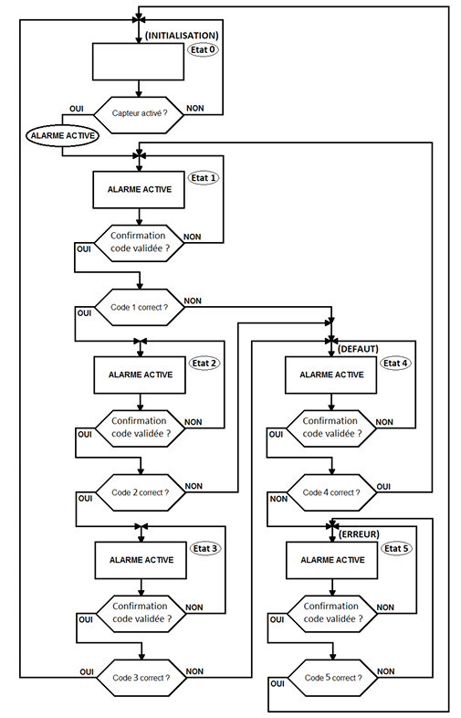

# Obstacle Detection Alarm Secured by Protection Codes

## Description

This project detects presence by interrupting a red LASER beam and triggers a frequency-modulated audible alarm. Disarming the alarm is protected by a sequence of three successive hexadecimal codes, with a rescue code and a super-code to handle errors.

## Table of Contents

- [Features](#features)
- [Required Hardware](#required-hardware)
- [Schematics](#schematics)
- [Installation](#installation)
- [Usage](#usage)
- [Contributing](#contributing)
- [License](#license)

## Features

- **Optical Detection**: Red LASER emitter and phototransistor pair, with push-button substitute during initial testing.
- **Audible Alarm**: Two-tone binary modulation (2 500 Hz / 5 000 Hz) at a 0.5 s period.
- **Security Sequence**: Three successive unlock codes (Code 1, Code 2, Code 3), one rescue code (Code 4), and one super-code (Code 5).
- **Visual Indicators**: Green LED for correct code entry, orange LED for a single fault, and red blinking LED for multiple errors.
- **Microcontroller**: STM32L476RG (StarterKit) with rotary encoder input and LCD display.

## Required Hardware

- **LASER emitter**: ADL-65075TL
- **Phototransistor**: BPX81
- **Operational amplifiers**: TL081, TL084
- **Comparator**: LM311
- **Timer**: NE555
- **Function generator**: XR2206
- **Mini speaker**: KSSG1708
- **Development board**: STM32L476RG
- **LEDs**: Green, orange, red (with resistors)
- **User inputs**: Rotary encoder and push-buttons

## Schematics

1. **System General Diagram**  
   
2. **Sensor Model**  
   
3. **Audio Signal Chain**  
   
4. **Unlock Sequence**  
   
